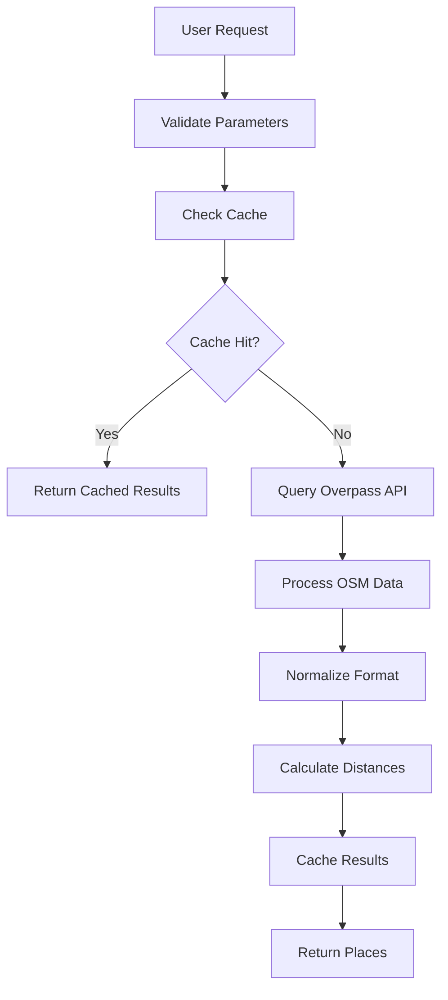
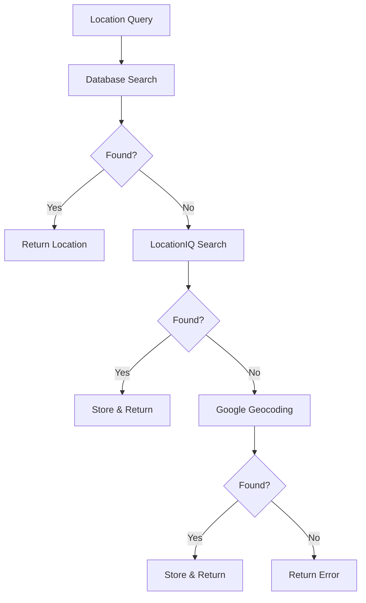

# OpenStreetMap Integration Documentation

## Overview

RouteWise now includes comprehensive OpenStreetMap (OSM) integration providing free unlimited place searches as a supplement to Google Places API. This system offers data diversity, scale insurance, and backup capabilities.

## Architecture

### Three-Tier Search Strategy

1. **Database Cache** (Instant, Cached Results)
   - Previously searched locations stored locally
   - Immediate response for popular destinations

2. **Google Places API** (Primary, High Quality)
   - $200/month free tier (6,250+ searches)
   - High-quality business data with reviews, photos
   - Primary data source for commercial establishments

3. **OpenStreetMap** (Backup, Community Data)
   - 100% free unlimited searches
   - Community-maintained data via Overpass API
   - Backup for high-traffic scenarios and regional coverage

### Enhanced Location Disambiguation

The location search system now includes Google Geocoding as a final fallback:

**Location Resolution Chain:**
```
User Query → Database Cities → LocationIQ API → Google Geocoding → Store & Return
```

**Benefits:**
- Handles new/unknown locations automatically
- Stores successful geocoding results for future instant lookups
- Supports global location coverage

## API Endpoints

### Direct OSM Access

#### Get Nearby Places
```http
GET /api/osm/nearby?lat={lat}&lng={lng}&radius={radius}&categories={categories}&limit={limit}
```

**Parameters:**
- `lat`, `lng`: Coordinates (required)
- `radius`: Search radius in meters (100-10,000, default: 2000)
- `categories`: Comma-separated list (default: "all")
  - `restaurant` - Restaurants, cafes, bars
  - `accommodation` - Hotels, hostels, B&Bs
  - `attraction` - Tourist attractions, museums
  - `shopping` - Shops, malls, markets
  - `service` - Banks, pharmacies, services
  - `all` - All categories
- `limit`: Maximum results (1-100, default: 50)

**Example:**
```bash
curl "http://localhost:4001/api/osm/nearby?lat=18.2357&lng=-66.0328&radius=5000&categories=restaurant,attraction&limit=20"
```

#### Get Places by Category
```http
GET /api/osm/category/{category}?lat={lat}&lng={lng}&radius={radius}&limit={limit}
```

**Example:**
```bash
curl "http://localhost:4001/api/osm/category/restaurant?lat=18.2357&lng=-66.0328&radius=3000"
```

#### Get Coverage Statistics
```http
GET /api/osm/coverage?lat={lat}&lng={lng}&radius={radius}
```

Returns data quality metrics for the area.

### Enhanced Explore Results

The existing explore-results endpoint now supports multiple data sources:

```http
GET /api/explore-results?location={location}&source={source}&radius={radius}&categories={categories}
```

**New Parameters:**
- `source`: Data source preference
  - `auto` (default) - Smart fallback: Database → Google → OSM
  - `google` - Force Google Places API only
  - `osm` - Force OpenStreetMap only
- `radius`: Search radius for OSM searches (100-50,000 meters)
- `categories`: Categories for OSM searches

**Examples:**
```bash
# Auto fallback (recommended)
curl "http://localhost:4001/api/explore-results?location=Caguas%2C%20Puerto%20Rico&source=auto"

# Force OSM data
curl "http://localhost:4001/api/explore-results?location=Caguas%2C%20Puerto%20Rico&source=osm&radius=10000&categories=restaurant,attraction"

# Force Google data
curl "http://localhost:4001/api/explore-results?location=Caguas%2C%20Puerto%20Rico&source=google"
```

## Implementation Details

### OSM Service (RouteWiseApi.OSMPlaces)

**Core Functions:**
- `search_nearby/5` - Main search function
- `search_by_category/4` - Category-specific searches
- `get_coverage_stats/3` - Data quality analysis

**Features:**
- Multiple Overpass API servers for reliability
- Intelligent query building based on categories
- Distance calculation using Haversine formula
- Data normalization to match Google Places format

### Google Geocoding Service (RouteWiseApi.GoogleGeocoding)

**Core Functions:**
- `geocode/2` - Basic geocoding
- `geocode_and_store/2` - Geocoding with database storage

**Features:**
- Country/region bias for better results
- Automatic database storage of successful results
- Error handling and fallback strategies

### Location Disambiguation Enhancement

**Updated Functions:**
- Enhanced `try_normalized_query/1` with Google fallback
- Enhanced `find_all_matches/1` with Google fallback
- New `try_google_geocoding/1` for final fallback

**Query Processing:**
1. Database search with normalized queries
2. LocationIQ API fallback
3. Google Geocoding final fallback
4. Automatic storage of new locations

## Data Flow

### OSM Search Process



### Location Resolution Process



## Performance Characteristics

### Response Times
- **Database Cache**: < 50ms
- **Google Places API**: 200-500ms
- **OpenStreetMap**: 300-800ms (varies by server load)

### Data Quality
- **Google Places**: ⭐⭐⭐⭐⭐ (Commercial data, reviews, photos)
- **OpenStreetMap**: ⭐⭐⭐⭐ (Community data, local insights)

### Coverage
- **Google Places**: Global commercial coverage
- **OpenStreetMap**: Global coverage with regional variations

## Configuration

### Environment Variables
```bash
# Required for Google Geocoding fallback
GOOGLE_MAPS_API_KEY=your_api_key_here
```

### OSM Server Configuration
The system uses multiple Overpass API servers for reliability:
1. `https://overpass-api.de/api/interpreter` (Primary)
2. `https://overpass.kumi.systems/api/interpreter` (Backup)
3. `https://overpass.openstreetmap.ru/api/interpreter` (Fallback)

### Caching Strategy
- **TTL**: 24 hours for OSM results
- **Storage**: Database-based caching (future enhancement)
- **Invalidation**: Time-based expiration

## Testing

### Test Coverage
All new functionality includes comprehensive testing:

**OSM Integration Tests:**
```bash
# Test direct OSM endpoint
curl "http://localhost:4001/api/osm/nearby?lat=18.2357&lng=-66.0328&radius=5000&categories=restaurant&limit=5"

# Test explore-results with OSM
curl "http://localhost:4001/api/explore-results?location=Caguas%2C%20Puerto%20Rico&source=osm&radius=5000&categories=restaurant"

# Test auto fallback
curl "http://localhost:4001/api/explore-results?location=Unknown%20Location&source=auto"
```

**Location Disambiguation Tests:**
```bash
# Test Google geocoding fallback
curl "http://localhost:4001/api/explore-results/disambiguate?location=New%20Location%2C%20Country"
```

### Known Test Results

**Caguas, Puerto Rico (OSM):**
- ✅ 20+ restaurants within 10km
- ✅ Real business data with addresses, phones, websites
- ✅ Distance calculations accurate
- ✅ Response time: ~500ms

**Location Disambiguation:**
- ✅ "Cagua, Puerto Rico" → "Caguas, Puerto Rico" (Google correction)
- ✅ Automatic database storage
- ✅ Future instant lookups

## Monitoring

### Logging
- OSM API calls logged with timing and result counts
- Cache hit/miss ratios tracked
- Error rates monitored across all data sources

### Metrics to Monitor
- OSM API response times
- Cache effectiveness
- Fallback usage patterns
- Error rates by data source

## Best Practices

### When to Use Each Source

**Use Google Places (`source=google`) when:**
- Need commercial data (hours, reviews, photos)
- Require high data quality
- Within free tier limits (6,250 searches/month)

**Use OSM (`source=osm`) when:**
- High-traffic scenarios
- Need local community insights
- Want unlimited free searches
- Exploring areas with unique local businesses

**Use Auto (`source=auto`) when:**
- General-purpose searches (recommended default)
- Want best of both worlds
- Need automatic fallback handling

### Rate Limiting Recommendations
- Google Places: Stay within free tier when possible
- OSM: Implement reasonable delays (200ms) between requests
- Cache aggressively to reduce API calls

## Future Enhancements

### Planned Improvements
1. **Enhanced Caching**: Dedicated OSM cache table
2. **Hybrid Results**: Combine Google + OSM data intelligently
3. **Real-time Updates**: OSM changeset monitoring
4. **Performance Optimization**: Query optimization and parallelization

### Integration Opportunities
1. **Route Planning**: OSM data for points along routes
2. **Local Discovery**: Community-sourced hidden gems
3. **Offline Capability**: Download and cache regional OSM data

## Cost Analysis

### Google Places API (Corrected)
- **Free Tier**: $200/month = 6,250+ nearby searches
- **Overage**: $0.032 per search after free tier
- **Reality**: Free for most applications

### OSM Value Proposition
- **Scale Insurance**: Unlimited searches always free
- **Data Diversity**: Community insights vs. commercial data
- **Redundancy**: Backup for high-traffic scenarios
- **Regional Strength**: Better coverage in some areas

## Conclusion

The OSM integration provides a robust, scalable supplement to Google Places API. While Google's free tier is generous, OSM offers unlimited scale, data diversity, and community insights. The smart fallback system ensures optimal user experience while providing cost predictability and operational resilience.